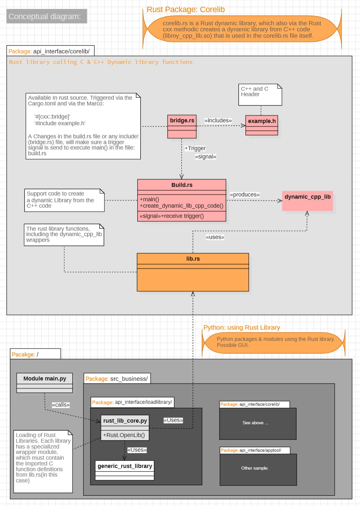

## 2 Create the Base Container

This chapter will cover the setup of the **Base Container Service** (folder: 'Base-Container') and everything else required to run a GUI application on a Windows host. At the end of this setup, we will demonstrate that the program works as expected by executing a sample X application in the Base Container (**xeyes**).

### The Basic Container Setup

Before executing the Docker Compose file, ensure that the following items are installed and configured (refer to section 1.1, Process Architecture). The steps for these items will be explained in more detail in the following paragraphs:

 Overview

- **Download the  WSL version of Ubuntu**: Obtain the special version of Ubuntu for WSL   ([Download)](https://learn.microsoft.com/en-us/windows/wsl/install-manual). Scroll to the bottom of the page for manual versions.
- **Install WSL2**: Set up a dedicated WSL2 environment to serve as the backend for the Docker container.
- **Configure the WSL Ubuntu Distribution**: Ensure that the WSL Ubuntu distribution is properly configured.
- **Install and Configure an X-Server**: Install an X-server on the Windows host; we use VcXsrv  ([Download](https://sourceforge.net/projects/vcxsrv/)) for this purpose.
- **Run Docker to Create the Basic Image**: Execute the Docker files to create the basic container image.
- **Verify the Setup**: Display the result to demonstrate that everything work

### Download the  WSL version of Ubuntu

For the rest of this installation we need the WSL Ubuntu manual installation files. Use the procedure in the ***Get the WSL Installation file*** to get the required installation file: ***'install.tar.gz'***

  
  
Get the WSL Installation file🔧
  

### Download the WSL Import file

- From [here](https://learn.microsoft.com/en-us/windows/wsl/install-manual).
- Scroll to the **"Downloading distributions"** section.
- Download the **Ubuntu 24.04 LTS** (should result into a file called: ***'Ubuntu2404-240425.AppxBundle'***)
- Unpack and get the installation from it in the next section

#### After getting the **WSL Import** file, get the installation from it

- Rename Ubuntu2404-240425.AppxBundle to Ubuntu2404-240425.zip
- Unpack it using 7zip or similar
- Find  Ubuntu_2404.0.5.0_x64.appx
  - Rename it to: Ubuntu_2404.0.5.0_x64.zip and unpack it.
  - **Unpack Result** you'll get the file: .\Ubuntu_2404.0.5.0_x64\install.tar.gz this is what you’ll use in the next step,

─── ✦ ───

 

### Install the Ubuntu WSL version

When we have the distribution source, we can install the WSL environment. To keep the Base Container files in one place we do this in the root of our Base-Service folder ( ***'./Base-Container/Afx-Base-PyCRust-Service/wsl2distro'***).

> *TIP:*{: style="color: green; font-size: 15px;"}
> <small>When you use **multiple** AFX Stacks, you can share the same WSL. These instructions install the WSL in a subfolder of the Stack (e.g., ./wsl2-distro). However, you can store the WSL in a central location. To do this, modify the command part **./wsl2-distro** to something like **D:/WSL/WSL-Data/docker-dev-pycrust**   </small>

- **Open** a Powershell CLI in the sub folder: ***'./Base-Container/fx-Base-PyCRust-Service/'***.
- **Execute** this command and replace the ***"install.tar.gz.file"*** with your location (full path)
  <pre class="nje-cmd-one-line-sm-indent1"> wsl --import docker-dev-pycrust ./wsl2-distro  "install.tar.gz" </pre>  

<!-- markdownlint-disable-next-line MD022 -->

- This creates a **docker-dev-pycrust** WSL distribution in: **./wsl2-distro**. 
- **Useful WSL management commands**:
  <pre class="nje-cmd-multi-line-sm-indent1">
  # Verify installation
  wsl --list --verbose

  # Start the distribution
  wsl -d docker-dev-pycrust

  # Stop the distribution  
  wsl --terminate docker-dev-pycrust

  # Execute command without opening terminal
  wsl -d docker-dev-pycrust -- ls /home

  # Set as default distribution
  wsl --set-default docker-dev-pycrust

  # Remove the distribution (if needed)
  wsl --unregister docker-dev-pycrust
  </pre>

### Configure the Ubuntu WSL version

Now we need to update and configure our distribution. Start the WSL distribution and execute the following Linux commands:

 Note: For each step, select and run the entire numbered section—including all comments

<pre class="nje-cmd-multi-line-sm-indent0" style="margin-top:-14px;">

# 1.1                                   # Update the Ubuntu distribution
apt update && apt upgrade -y            

# 1.2.                                  # Make sure docker is installed in the WSL                    
apt update && apt install docker.io -y  # to be able to attach to a container in the Host 

# 2.1 The next command will update our DISPLAY environment variable
export DISPLAY=$(grep -oP "(?<=nameserver ).+" /etc/resolv.conf):0

# 2.2.                                  # Display the variable (check)
echo $DISPLAY                          

# 3.1 Make sure the Docker daemon is start at start up
echo -e "\n# Start Docker daemon if not running\nif (! pgrep -x \"dockerd\" > /dev/null); then\n    sudo  dockerd & \nfi" >> ~/.bashrc

# 3.2 Let make sure to easily identify the container (prompt)
echo 'PS1="\[\033[91m\]WSL:\[\033[0m\]\[\033[0;33m\]${debian_chroot:+($debian_chroot)}\u\[\033[0m\]:\[\033[91m\] App-X11-Win32Dev \[\033[0m\]../\W# "' >> ~/.bashrc

# 4 Make sure to reload the start-up command, to apply the 3.* commands
source ~/.bashrc                  # Reload
Enter                             # YOU need to give an extra enter so the prompt returns
                                  # check with: ps -a  should show dockerd

# Optional to logout and leave the wsl running
exit
</pre>

### Install the X-Server (VcXsrv)

To install the X-Server in the Windows host, and receive graphical output from the WSL application, follow these instructions:

- [Download]( https://sourceforge.net/projects/vcxsrv/) and Install the VcXsrv software.
- After installation start XLaunch
  - Select **Multiple Windows** and click **Next**
  - Select Start **no client** and click **Next**
  - Ensure that **Clipboard** and **Native opengl** are **enabled**'
  - Ensure that **Disable access control** is **not enabled** ( this is more secure; only enable it if you encounter issues) click **Next**, then **Finish**

### Create the basic Docker Container

Let's get to the real thing and start creating the base container.

- Open the service sub folder: ***'.\Base-Container\Afx-Base-PyCRust-Service\***' within a new CMD
- Make sure you are **login** into **Docker**
- We use a fixed IP address in the Compose file to make it easier to communicate with services, such as an SSH server (not used in this setup). While this is not strictly necessary, we have included it by default. If you encounter any issues, you may choose to remove it from the **compose_app_forward_x11_pycrust_base.yml** file. The pre-configured IP address used can be found in the **.env** file. see:

<pre class="nje-cmd-multi-line-sm-indent4" style="margin-top:-14px;"> FIXED_SUBNET  # Default: 172.25.0.0/16            FIXED_IP      # Default: 172.25.0.18</pre>

- Execute this command in the service sub folder
  <pre class="nje-cmd-one-line-sm-indent1"> docker-compose -f  compose_app_forward_x11_pycrust_base.yml up -d --build --force-recreate  --remove-orphans </pre>

- In Docker Desktop a container is present with the name:***afx-base-pycrust-service/axf-basic-pycrust-service-1***
- In Docker Desktop a image is present with the name:  ***eelhart/appforwardx11-pycrust-base:latest*** This image is used by other sub containers!

  
Recreate Containers
  

  When recreating the same container(service name) avoid subtle/annoying caching issues, to avoid irritation, make sure to:
  - delete the container
  - delete the volume and 
  - use the Docker prune command,so: 
    <pre class="nje-cmd-one-line-sm-ident1"> docker system prune -a --volumes</pre>

 

  
Don't Delete the base image (yet)
  

  The interesting parts will be inside the sub-containers that you are going to install next. For this reason, you can delete the created container (Because the sub container adds on to the base container), but you must keep the image file, as the sub-containers will need it! 

  But at this point: **Don't delete** the base container yet. First, let's ensure everything works as expected. This will be covered in the next subsections.

  Remove Unused containers for good with:
  <pre class="nje-cmd-one-line-sm-ident1"> docker system prune -a --volumes</pre>

 

### Start Docker from the WSL Distribution

**The Problem:** When running multiple WSL distributions, Docker Desktop's automatic integration (Settings → Resources → WSL integration) cannot reliably control which distribution is used—Docker may randomly select any enabled distribution.

**Our Solution:** Start the Docker container directly from a specific WSL distribution to guarantee predictable behavior.

**Why Both Are Needed:**

#### Prerequisites

1. **Enable WSL integration in Docker Desktop settings**
   - Go to Docker Desktop → Settings → Resources → WSL integration
   - Select your WSL distribution (e.g., `docker-dev-pycrust`) and ensure only this one is enabled
   - Click Apply & Restart to activate the integration (this may restart Docker Desktop automatically)
   - This step is essential for communication between WSL and Docker Desktop

2. **Restart Docker Desktop** (the application, not just the container) if it did not restart automatically
   - Without this, you may run into trouble when attaching from WSL
   - Error symptom: ***"cannot find the container"***

3. **Ensure the container is running** in Docker Desktop (check the dashboard)

4. **Use the specific WSL startup procedure described below**
   - Always start containers from the correct WSL distribution to ensure X11 forwarding works

#### Steps to Connect the Base Container

Execute these commands to attach to the container from the correct WSL distribution:

 <small>(Assumes default service name and WSL distribution name from previous steps)</small>

  <pre class="nje-cmd-multi-line-sm-indent0">
  # Step 1: Start the specific WSL distribution using the PowerShell CLI
  # (Docker daemon inside WSL will start automatically - press Enter a few times if needed)
  wsl -d docker-dev-pycrust
  
  # Step 2: From within the WSL CLI, attach to the Docker container running on the host
  # (Use 'docker ps' from the host to verify the container name if you changed it)
  docker exec -it afx-base-pycrust-service-axf-basic-pycrust-service-1 /bin/bash
  
  # Troubleshooting: If the container cannot be found, restart Docker Desktop and try again
  </pre>

   **After these commands you can**:  
    - Execute commands at the command line prompt (see: 2.1.7 Verify the Setup)  
    - Open the Docker container in **VSC**, with the correct WSL assigned (see section 4)  
  

  
Docker Desktop WSL Integration: Required Setup & Workflow Choice
  

## WSL Integration Is Required

Enabling WSL integration in Docker Desktop is **always required** for this development environment. This allows Docker Desktop to communicate with your WSL distributions and containers.

## Two Workflows: Recommended vs. Automatic

**1. Recommended Workflow (for most users, especially with multiple WSLs):**
- Enable WSL integration in Docker Desktop (see steps below)
- Start containers directly from your chosen WSL distribution (using `wsl -d <distro>` and Docker CLI)
- This ensures predictable behavior and correct X11 forwarding.

**2. Automatic Selection Workflow (not recommended, only for single/default WSL setups):**
- Enable WSL integration in Docker Desktop
- Let Docker Desktop automatically select the WSL distribution when starting containers
- This can be unpredictable if multiple WSLs are enabled, as Docker may randomly select one.

**Limitation:** With multiple WSL distributions enabled, Docker Desktop may select any of them, leading to confusion or broken setups. Always prefer the recommended workflow above.

## How to Enable WSL Integration

1. Open **Docker Desktop** → **Settings** → **Resources** → **WSL integration**
2. In the **'Enable integration with additional distros:'** section:
  - If you don't see this option, click **Refetch distros**
  - Locate and select **`Ubuntu-docker-App-X11-Win32Dev`**
  - **Ensure only this distribution is selected** (disable others to avoid conflicts)
3. Click **Apply & Restart**
  - Docker Desktop should restart automatically
  - You may need to manually restart the container if it doesn't reconnect

**Troubleshooting:** If clicking "Apply & Restart" doesn't take effect, try running Docker Desktop with **Administrator rights**, then repeat the steps above.

### 2.1.7 Verify the Setup

After running the command in section [Create the basic Docker Container](#create-the-basic-docker-container) and the section above, we can test if the setup **succeeded**. Make sure the docker container is started from our WSL (see above)

##### Verify the X Output

- In the Docker container Bash CLI prompt (which you just opened via the wsl), enter:
  <pre class="nje-cmd-one-line-sm-ident1"> xeyes</pre>
  *This should display a pair of eyes in a Window (X is working properly)*. *When you don't see it check if XLaunch is started.* 

#### Verify the build environment (optional)

- Use the **'nano'** command to create a new file **'hello.c'** with this content:
  <pre class="nje-cmd-multi-line-sm">  #include &lt;windows.h&gt;
  int WINAPI WinMain(HINSTANCE hInstance, HINSTANCE hPrevInstance, LPSTR lpCmdLine, int nCmdShow)
  {
          MessageBox(NULL, "Hello, Win32!", "Win32 Program", MB_OK);
          return 0;
  }
  </pre>

- Check if we can build the program:
   <pre class="nje-cmd-multi-line-sm"># BUILD Commands:
   i686-w64-mingw32-gcc hello.c -o out.exe        # Creates 32 bits App
   # x86_64-w64-mingw32-gcc hello.c -o out.exe    # Creates 64 bits App
   # i686-w64-mingw32-c++ hello.c++ -o out.exe    # Creates 32 bits App
   # x86_64-w64-mingw32-gcc hello.c++ -o out.exe  # Creates 64 bits App </pre>
  
- And finally check if it runs
    <pre class="nje-cmd-multi-line-sm">wine ./out.exe</pre>
    *This should display a Window with 'Hello' in it (Build configured properly)* 

##### Verify the Linux C/C++ build environment (optional)

- Lets see if the default Linux gcc is available
  <pre class="nje-cmd-multi-line-sm">gcc -v
  # This should display the Linux target in the string. It should contain:
  # ...
  # Target: x86_64-linux-gnu
  # ...
  # The following command returns all available targets:
  ls /usr/bin/*gcc*
  # Which should contain at least:
  # ...
  # /usr/bin/x86_64-linux-gnu-gcc-13
  # /usr/bin/x86_64-w64-mingw32-gcc-13
  # ...
  </pre>

##### Verify the Python and Rust environment (optional)

- Python an Rust available?
  <pre class="nje-cmd-multi-line-sm">python3 --version
  # This should display the Python version, in my case : 3.12.3
  # 
  rustc --version
  # This should display tte Rust version, in my case : 1.82.0
  #
  </pre>

When these tests are passed your basic container is good to go.

---

## 2.2 What do we have and What's next?

After the previous setup, the Base Container now includes:

- **MinGW** - Win32 cross-compiler (32-bit and 64-bit support)
- **Wine** - Windows emulator for running Win32 executables
- **X11 forwarding** - Configuration to display GUI applications on the Windows host
- **GCC C/C++** - Development tools
- **Python** - Development tools
- **Rust** - Development tools

***How It Works (Graphical output to the Windows Host)***  
We now have a Docker container that uses **MinGW** to provide the **Win32 API** for creating **basic Win32 desktop applications** for Windows. The created application can be executed in this Docker container using **Wine**, a Windows emulator. The X11 configuration, which is part of this setup, along with the XLaunch server on the Windows host, ensures that the executed application is displayed in a window on the Windows host.

**What's Next:**  
Next, proceed to **Section 3**, where you will set up a Docker sub-container containing a template application. This template **combines** a **Python** framework as the front-end with a **Rust/C/C++** implementation as the back-end.

---

## 3. Creating the Sub containers

This section explains how to create a **sub-container**, which houses the actual **pycrust** template project. Currently, there is only one sub-container, but additional template versions may be introduced in other sub-containers in the future. Before proceeding, ensure that you have already created the **Base Container** as described in the previous section and verify that it is functioning correctly.

In the **Sub-Containers** folder, each sub-container is stored in its own separate folder. Sub-containers typically include specific project templates, such as Visual Studio Code settings, build tasks, and any required build tools or libraries. This particular image is designed for **Python**, **Rust**, and **C/C++** development, so the focus will be on these languages, their tools, and frameworks. The resulting application will be displayed in a window on the Windows host.

 

### Creating pycrust template application <small>(compose_pycrust_project)</small>

This sub-container is used to create a project that combines a front-end (GUI/Web) with a back-end (Rust, C/C++) application. In the .env file, the following setting is used to install the template project: 
<pre class="nje-cmd-one-line-sm-indent1"> PRJ_TYPE_USE_CUSTOM_APP=Yes</pre>
Refer to Section 4 for the global usage of this container in Visual Studio Code (**VSC**). Any specifics regarding the usage of this container in VSC will be detailed at the end of this section.

### Steps to Create a pycrust template project container

1. Open a Command Prompt in: ***.\Sub-Containers\PyCRust-Project-Service\\***
2. **Configure the project**:
   - Open the ***.env*** file to adjust the necessary settings:   
        - **Project Name**: Set the variable **PRJ_NAME_ARG** to your desired project name. This will be used for both the project name and the project directory.If omitted, the default value from **PRJ_NAME_ARG** in the **.env** file will be used.
        - **Network Configuration**: If needed, you can specify an alternative subnet and IP address by adjusting the variables **FIXED_SUBNET** and **FIXED_IP**.    
3. Execute the Docker command to create the project:
   <pre class="nje-cmd-one-line-sm-indent1">docker-compose -f compose_pycrust_project.yml up -d --build --force-recreate --remove-orphans </pre>
   *Note: This will create a container and a PyCRust Win32 Desktop template project by default.*

 

### Attach to the pycrust container

After running the commands in 3.1 you can start the **pycrust sub container'** in combination with the WSL. See the **side note: Start Docker via WSL** if you need help with this.  Once started you can use Visual Studio Code (VSC) to start developing the application you planned to, for help with VSC see Section 4.  Here in short the steps to start/attach to the container in a WSL distribution

- In an OS Terminal: Start the WSL and attach Docker in the WSL:
  <pre class="nje-cmd-multi-line-sm">

  wsl -d docker-dev-pycrust

  # In the Resulting WSL terminal attach the docker container:
  #   - When it is not started you can do this here with:
        docker exec -it pycrust-project-service-axf-pycrust-project-1  /bin/bash
  #
  # In case of err see 'Error checks'

  # Use command 'pwd' to check your directory location
  # Make sure XLaunch is started on the host!
  # WARNING: When the container can't be found, first try to restart the Docker service!
  </pre>

Commands to check your installation in the Docker terminal:
<pre class="nje-cmd-multi-line-sm">
pwd                        # Should displays your project directory including source code 
xeyes                      # Displays gazing eyes
python --version           # Displays Python version
 </pre>
Yes, your development will typically be in Visual Studio Code or another IDE, but these CLI steps should demonstrate that everything is working correctly.

---

 

## 4 Develop with VSC in the host

To develop in **V**isual **S**tudio **C**ode we advice the following instructions 

- First make sure you have the following extensions locally install, to be able to work with the docker containers:
  - **Remote Development**. Attach VSC to Docker(Develop directly inside our Docker container ), Remote WSL, Develope on remote SSH, GitHub Codespaces. 
  - **Docker** (Microsoft)
  - **Dev Containers** (Microsoft) optional

### Open the C++ application container in VSC (@host)

- Mak sure Docker can be attached from the WSL! See [here](#attach-to-the-pycrust-container)
- Press CTRL-SHIFT-P or F1 and select (start typing) **Attach to running container...**
- Select our **pycrust-project-service-axf-pycrust-project-1** container
- Alternatively you might click on the **Docker boot** on the left toolbar and select the container from there.  
This opens a new Window with the  container information

### Open Folder and building your app.

- Use the **VSC Explorer** and the **Open Folder** to open the remote container's folder. **Ensure** you open the correct folder so that the **.vscode** directory settings are applied properly.
  - Select Open Folder and enter: **/projects/pycrust/project_name**. This will ensure the project is loaded along with the settings configured in the .vscode folder. (Alternatively, you can obtain the path by opening a terminal inside the Docker container. The initial folder shown by the pwd command will give you the correct path.)

  
 Recommend extensions
  

  For this Docker project we have a few extensions defined, please allow these in during the opening of the container, so when you see something like: ***'Do you want to install the recommended extensions from ...'*** Press on the **Install**  button, this makes sure all functionality will work as defined, see the file ***.vscode/extensions.json*** for the recommend extension list.

 

When opening the **pycrust** container and the project root folder in Visual Studio Code, a dedicated Visual Studio Code server will be installed within the container. This server provides a full Visual Studio Code environment with its own settings and extensions, which we have provided (see the side note below). Upon opening the folder for the first time, the system will detect any required extensions and may prompt you to install them. If so, follow the instructions to complete the installation. For a list of extensions, refer to the side note below.

## Visual Studio Code container extensions

Specific extensions for this container are installed. Local extensions should be disabled for this container to prevent poor performance in Visual Studio Code and avoid other side effects. Container-specific extensions are listed in the file located at: ***.devcontainer/devcontainer.json.***
and are required, included extensions are: 

 ms-vscode.cpptools  
 ms-vscode.cmake-tools  
 ms-vscode.cpptools-extension-pack 
 ms-vscode.makefile-tools 
 ms-python.vscode-pylance 
 ms-python.python 
 "ms-python.debugpy" 
 "vadimcn.vscode-lldb" 
 rust-lang.rust-analyzer" 
 xyz.local-history 

  
Extensions not automatically installed?
  

  While these extensions should install automatically, I have experience issues with them. Check is they if are installed, and if not them manually with the command below: 
  In the opened container in the VS Code terminal session enter:
  <pre class="nje-cmd-multi-line">

  code --install-extension ms-python.vscode-pylance
  code --install-extension ms-python.python
  code --install-extension ms-vscode.cpptools
  code --install-extension ms-vscode.cmake-tools
  code --install-extension ms-vscode.makefile-tools
  code --install-extension rust-lang.rust-analyzer
  code --install-extension ms-vscode.cpptools-extension-pack
  code --install-extension ms-python.debugpy
  code --install-extension xyz.local-history
  code --install-extension vadimcn.vscode-lldb

  </pre>

 

Similar to the extensions, we also provide default settings for this container. These settings define the global configurations as well as the default build and run behavior. The build and run behavior is explained in the next section (4.3). See the side note below for details.

---

 

### VSC Build tasks

In the menu **'Terminal -> Run Tasks...'** You can find the build task for our project, which are defined in the .vscode directory in the file 'tasks.json'. All our build task start with the prefix: AFX (_AFX are implementation task and are by default hidden)

 

  
    Task name
    Description
  
  
    AFX BUILD 1: Libraries (Rust,LINUX)
    Builds the Rust libraries inside: src_backend\api_interface_rust for Linux (with question)
  
  
    AFX BUILD 2: Libraries (Rust,WINDOWS)
    Builds the Rust libraries inside: src_backend\api_interface_rust for Windows (with question)
  
  
    AFX BUILD 3: Client Library Tester (Rust LINUX, debug)
    Builds the client test program related to the Rust library in  1(see also create 5)
  
  
    AFX Create 4: business Library (Rust)
    This create a whole new Rust library in: src_backend\api_interface_rust
  
  
    AFX Create 5: Client Library Tester (Rust LINUX)
    This Creates the client test program for a Rust library (see also 3 for build)
  
  
    AFX CLEAN 6: Rust Libraries (LINUX Debug,release) 
    Removes all build artifacts for the Linux release, Debug and Release
  
  
    AFX CLEAN 7: Rust Libraries (WINDOWS Debug,release)
    Removes all build artifacts for the Windows release, Debug and Release
  
  
    
    
  

### Run &Debug

A few launches are defined

- **Python (Debugpy)**  for python
- **Python + Rust** for Python and Rust libraries

In All case you must make sure tha the Rust library is build AFX BUILD task 1. This is beacuse the current main.py sample call the Rust (Rust call internal and other library which is build together with Rust) and functions

### 4.5  Backup

There is a simple backup script which you can use to backup the project to **shared-host** directory. In a Docker shell (root) execute:
<pre class="nje-cmd-one-line-sm">./_backup </pre>
 

 
    Appendix I  - Quick setup 

## Quick setup

If you have previously installed this container, you can use the quick setup steps below. Otherwise please first read the [how to create a development container](https://nicojane.github.io/APP-X11-Forward-PyCRust-Development-Template-Stack/Howtos/howto_create_a_dev_container) document.

- In case you don't have the **WSL** container, open CMD in the folder: ***'APP-X11-Forward-PyCRust-Development-Template-Stack\Base-Container\Afx-Base-PyCRust-Service\'*** and execute:
  <pre class="nje-cmd-one-line-sm-indent1"> wsl --import docker-dev-pycrust ./wsl2-distro  "install.tar.gz"  </pre>
- Create docker base container (Afx-Base-PyCRust-Service)
  <pre class="nje-cmd-one-line-sm-indent1">docker-compose -f  compose_app_forward_x11_pycrust_base.yml up -d --build --force-recreate  --remove-orphans </pre>
- Install C++ sub-container (PyCRust-Project-Service)
   <pre class="nje-cmd-one-line-sm-indent1">docker-compose -f compose_pycrust_project.yml up -d --build --force-recreate --remove-orphans  </pre>
  
    <pre class="nje-cmd-multi-line-sm">

### Start WSL

  <pre class="nje-cmd-multi-line-sm">wsl -d docker-dev-pycrust  </pre>

### Attach docker

<pre class="nje-cmd-multi-line-sm">
docker exec -it PyCRust-Project-Service /bin/bash 
# If the container cannot be found, restart the Docker app and ensure 
# WSL integration is enabled in Docker settings!
</pre>

### VSC extensions

After this you should be able to open the container in VSC and start developing, be sure to run the following commands(in the container) first to make sure the required extensions are installed: 
<pre class="nje-cmd-multi-line-sm">
code --install-extension ms-python.vscode-pylance
code --install-extension ms-python.python
code --install-extension ms-vscode.cpptools
code --install-extension ms-vscode.cmake-tools
code --install-extension ms-vscode.makefile-tools
code --install-extension rust-lang.rust-analyzer
code --install-extension ms-vscode.cpptools-extension-pack
code --install-extension ms-python.debugpy
code --install-extension xyz.local-history
code --install-extension vadimcn.vscode-lldb
</pre>

 

 
    Appendix II  -  pycrust template structure 

## Pycrust template structure

Following is a concept diagram of the sample Rust library 'core_lib' which internally opens an other C++ library and call a function from there

 

 
<i><b>License</b> This file is part of: **Python/Rust/C++ Development Stack**  Copyright (c) 2025-2026 Nico Jan Eelhart.This repository is [MIT licensed](MIT-license.md) and free to use. For optional commercial support, customization, training, or long-term maintenance, see [COMMERCIAL.md](COMMERCIAL.md).</i>

  

─── ✦ ───

